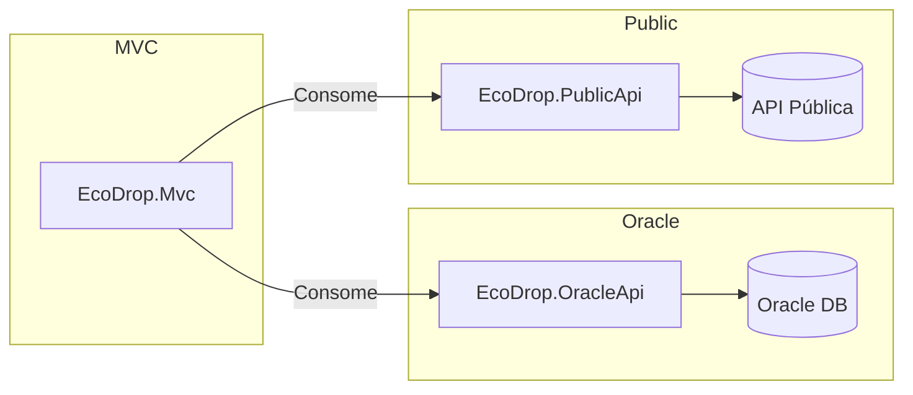

# EcoDrop

## 📌 Descrição do Projeto
O **EcoDrop** é um sistema desenvolvido em .NET 9, dividido em múltiplos projetos (arquitetura em camadas e microsserviços) para gerenciar pontos de reciclagem, integrando:
- **OracleApi** → WebAPI conectada a banco Oracle via EF Core.  
- **PublicApi** → WebAPI consumindo um endpoint público com resiliente handling (Polly).  
- **Mvc** → Aplicação MVC que consome as duas APIs e exibe dados em views.  
- **Libraries** → Domain, Application e Infrastructure, garantindo separação de responsabilidades.  

---

## 🚀 Estrutura do Projeto
```
EcoDropCp/
│── src/
│   ├── EcoDrop.Domain/         # Entidades de domínio
│   ├── EcoDrop.Application/    # Regras de negócio
│   ├── EcoDrop.Infrastructure/ # DbContext + Migrations Oracle
│   ├── EcoDrop.OracleApi/      # API Oracle com CRUD
│   ├── EcoDrop.PublicApi/      # API pública com Polly e Swagger
│   ├── EcoDrop.Mvc/            # Projeto MVC para consumir APIs
```

---

## ⚙️ Passo a Passo para Rodar Localmente

### Pré-requisitos
- .NET 9 SDK  
- Oracle XE ou outra versão compatível  
- Visual Studio / VS Code  
- Git instalado

### Configuração do Banco Oracle
No arquivo `appsettings.json` da **EcoDrop.OracleApi** configure a connection string:

```json
"ConnectionStrings": {
  "OracleDb": "User Id=RM555306;Password=230904;Data Source=oracle.fiap.com.br:1521/ORCL"
}
```

### Executar Migrations
```bash
dotnet ef migrations add InitialCreate -p src/EcoDrop.Infrastructure -s src/EcoDrop.OracleApi
dotnet ef database update -p src/EcoDrop.Infrastructure -s src/EcoDrop.OracleApi
```

### Subir os projetos
- OracleApi:  
```bash
dotnet run --project src/EcoDrop.OracleApi
```  
- PublicApi:  
```bash
dotnet run --project src/EcoDrop.PublicApi
```  
- Mvc:  
```bash
dotnet run --project src/EcoDrop.Mvc
```  

### URLs principais
- OracleApi → [http://localhost:5175/swagger](http://localhost:5175/swagger)  
- PublicApi → [http://localhost:5242/swagger](http://localhost:5242/swagger)  
- MVC → [http://localhost:5276](http://localhost:5276)  

---

## 🧩 Princípios SOLID Aplicados
- **SRP (Single Responsibility Principle)** → Cada camada e controller possui apenas uma responsabilidade clara.  
- **OCP (Open/Closed Principle)** → Services e Repositories podem ser estendidos sem modificar código existente.  
- **DIP (Dependency Inversion Principle)** → Controllers e Services dependem de abstrações, não de implementações diretas.  

---

## 🔑 Endpoints Principais

### OracleApi
- `GET /api/MaterialTypes`
- `POST /api/MaterialTypes`
- `GET /api/RecyclingPoints`
- `POST /api/RecyclingPoints`

### PublicApi
- `GET /api/ExternalData/posts` (consome JSONPlaceholder)

### MVC
- `/RecyclingPointsMvc` → Exibe dados da OracleApi  
- `/ExternalDataMvc` → Exibe dados da PublicApi  

---

## 📬 Exemplos de Request/Response

### OracleApi – Criar MaterialType
**Request**
```http
POST http://localhost:5175/api/MaterialTypes
Content-Type: application/json

{
  "name": "Plástico"
}
```
**Response**
```json
{
  "id": 1,
  "name": "Plástico"
}
```

### OracleApi – Listar RecyclingPoints
**Request**
```http
GET http://localhost:5175/api/RecyclingPoints
```
**Response**
```json
[
  {
    "id": 1,
    "name": "Ponto Central",
    "address": "Rua A, 123"
  },
  {
    "id": 2,
    "name": "Ponto Zona Sul",
    "address": "Av. B, 456"
  }
]
```

### PublicApi – Consumindo JSONPlaceholder
**Request**
```http
GET http://localhost:5242/api/ExternalData/posts
```
**Response**
```json
[
  {
    "userId": 1,
    "id": 1,
    "title": "sunt aut facere repellat provident occaecati",
    "body": "quia et suscipit suscipit recusandae..."
  },
  {
    "userId": 1,
    "id": 2,
    "title": "qui est esse",
    "body": "est rerum tempore vitae sequi sint nihil..."
  }
]
```

### MVC – Página `/RecyclingPointsMvc`
Renderização da View:
```html
<table>
  <tr><td>1</td><td>Ponto Central</td><td>Rua A, 123</td></tr>
  <tr><td>2</td><td>Ponto Zona Sul</td><td>Av. B, 456</td></tr>
</table>
```

---

## 🖼️ System Design



